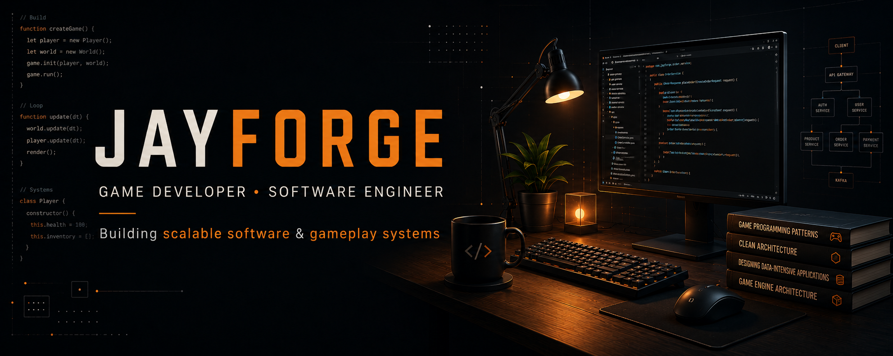

  

---

# Hi, I'm Jayanth (JayForge) 👋

Software Engineer with **4+ years of professional experience** building backend systems, distributed applications, and scalable software.

Alongside my professional experience, I build Unity projects focused on gameplay systems, simulation mechanics, and management-style games.

---

## Featured Projects

### 🎮 Cinema Rush

Published Unity management-style simulation game featuring customer AI, queue management, seating systems, progression mechanics, game economy, and save functionality.

* 🌐 [Game Projects](https://jayforge-dev.github.io/projects/games.html)
* 🎮 [Cinema Rush itch.io](https://jayforge.itch.io/cinema-rush)

---

### 💻 E-Commerce Microservices Platform

Event-driven backend built with Java, Spring Boot, Apache Kafka, and the Outbox pattern, exploring modern microservices architecture and distributed transaction handling.

* 🌐 [Software Projects](https://jayforge-dev.github.io/projects/software.html)
* 📦 [GitHub Repositories](https://github.com/jayforge-dev?tab=repositories)

---

## 🔧 Technologies

- **Unity & Game Development:** Unity, C#, Gameplay Programming
- **Backend:** Java, Spring Boot, Python, FastAPI, Flask
- **Distributed Systems:** Apache Kafka, RabbitMQ
- **Databases:** PostgreSQL, MySQL, MongoDB
- **Tools:** Docker, Git, Jenkins

---

## 🎯 Current Focus

- Building scalable backend systems
- Developing gameplay systems and simulation mechanics
- Building and expanding through personal projects
- Software Engineering & Unity Game Development opportunities

---

## Connect

- **Portfolio:** [JayForge](https://jayforge-dev.github.io)  
- **LinkedIn:** [JayForge](https://linkedin.com/in/jayforge)
- **itch.io:** [JayForge](https://jayforge.itch.io)
